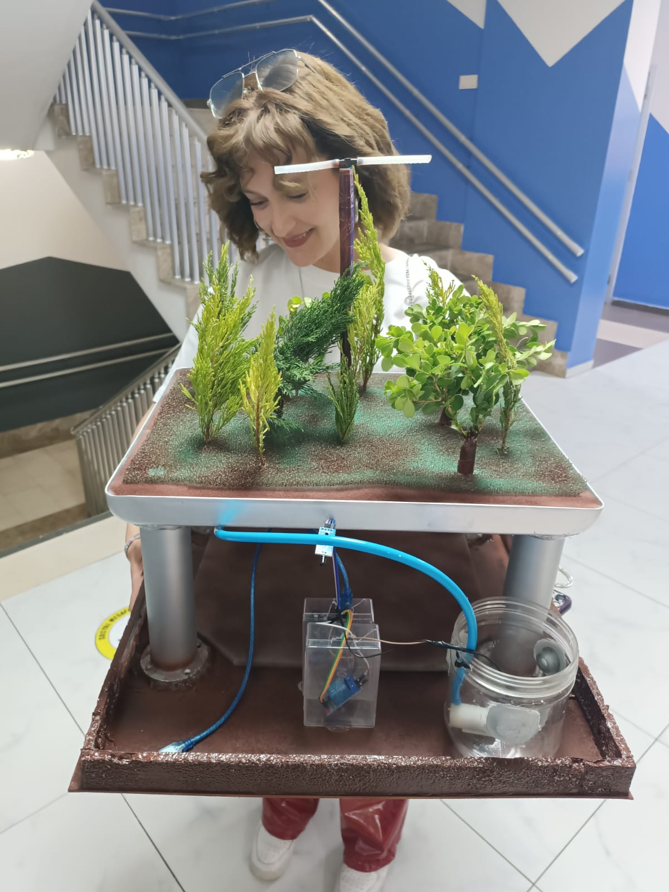

"# Sulama" 
<h1>Orman Yangınları için geliştirilen bir projedir.Sıcaklık sensörü kullanarak tasarlanan bu projede ısı algılaması sonucu otomatik sulama devreye girer ve çıkan yangını söndürme amaçlı kullanılabilir.</h1>

